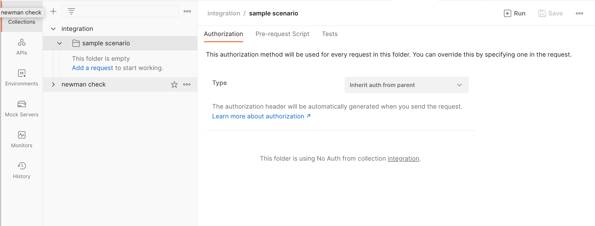

# kuroco-newman 導入方法

## インストール
初めに、E2Eテストを導入する対象のリポジトリにkuroco-newmanをインストールします。
```sh
npm install --save-dev github:diverta/kuroco-newman
```

インストールが完了したら、`kuroco-newman init`を実行し、テストの実行に必要なファイル・ディレクトリの初期化を行います。

```sh
npx kuroco-newman init
```

画面の指示に従い、必要な項目を入力してください。

| 入力項目 | デフォルト値 | 説明 |
| :- | :- | :- |
| tests base directory | `tests` | テストコードを管理するためのディレクトリを指定します。 |
| report output directory | `reports` | テストレポートを出力するためのディレクトリを指定します。 |
| target site name |  | テスト実行対象となるサイトの名称を指定します。 |

<!-- https://diverta.gyazo.com/0fff117cedb27ba6d52a04eeb2c1f8c3 -->


入力完了後、カレントディレクトリ内に以下のファイル・フォルダが生成されます。
```
.
|-- {report output directory}
|-- {tests base directory}
|   `-- {target site name}
|       |-- collections
|       |-- environments
|       `-- fixtures
`-- kuroco-newman.config.json
```

## Postmanコレクションファイルの作成

### ワークスペースの作成
Postmanのワークスペースを作成します。ワークスペースはテスト対象のサイト毎に作成することを推奨します。

### コレクションの作成
Postmanのコレクションを作成します。

### Collection variablesの設定
全リクエストで共通利用する変数を[Collection variables](https://learning.postman.com/docs/sending-requests/variables/#choosing-variables)として定義します。

### Pre-request scriptの設定

[Pre-request script](https://learning.postman.com/docs/writing-scripts/pre-request-scripts/)を利用すると、テストコードの前処理を定義することができます。   
これを利用して、コレクション内のテストスクリプトで共通利用するためのメソッドを定義します。  

<details>

<summary>Pre-requestスクリプトの設定例</summary>

```js
postman.setGlobalVariable('kuroco', (apiConfig = {apiId: 1}) => {
    // Please edit each values for your environment
    const endpointConfig = {
        // api_id: {/* endpoint list */}
        1: {
            login: '/rcms-api/1/auth/login',
            token: '/rcms-api/1/auth/token',
            logout: '/rcms-api/1/auth/logout',
            memberInsert: '/rcms-api/1/members/insert'
        },
        3: {
            login: '/rcms-api/3/auth/login',
            logout: '/rcms-api/3/auth/logout'
        }
    };
    class Kuroco {
        constructor(apiConfig) {
            this.apiId = apiConfig.apiId;
            if (!endpointConfig[this.apiId]) {
                throw new Error(`Endpoint configuration not found: api_id=${this.apiId}`);
            }
            this.endpointConfig = endpointConfig[this.apiId];
        }
        /**
         * Common
         */
        getEndpoint(name) {
            if (!this.endpointConfig[name]) {
                throw new Error(`Endpoint configuration not found: api_id=${this.apiId}, name=${name}`);
            }
            return this.endpointConfig[name];
        }
        getBaseUrl() {
            const collectionBaseUrl = pm.collectionVariables.get('baseUrl');
            const matches = collectionBaseUrl.match(/{{(.+)}}/);
            if (matches && matches.length > 0) {
                return pm.environment.get(matches[1]);
            }
            return collectionBaseUrl;
        }
        getRequestDef(path, body, accessToken = '') {
            return {
                async: false,
                url: `${this.getBaseUrl()}${path}`,
                method: 'POST',
                header: {
                    'Content-Type': 'application/json',
                    ...accessToken
                        ? {'X-RCMS-API-ACCESS-TOKEN': accessToken}
                        : {}
                },
                body: JSON.stringify(body)
            }
        }
        /**
         * Authentication
         */
        login(memberAuth) {
            const loginRequest = this.getRequestDef(this.getEndpoint('login'), {
                ...memberAuth,
                "login_save": 0
            });
            pm.sendRequest(loginRequest, (err, response) => {
                const { grant_token, info } = response.json();
                console.log(response);
            });
        }
        logout() {
            const loginRequest = this.getRequestDef(this.getEndpoint('logout'), {});
            pm.sendRequest(loginRequest, (err, response) => {
                console.log(response);
            });
        }
        /**
         * Authentication (Token)
         */
        generateToken(memberAuth) {
            const loginRequest = this.getRequestDef(this.getEndpoint('login'), {
                ...memberAuth,
                "login_save": 0
            });
            const getTokenRequest = (grant_token) => this.getRequestDef(this.getEndpoint('token'), {
                grant_token
            })
            pm.sendRequest(loginRequest, (err, response) => {
                const { grant_token } = response.json();
                pm.sendRequest(getTokenRequest(grant_token), (err, response) => {
                    console.log(response);
                    const accessToken = response.json().access_token.value;
                    const refreshToken = response.json().refresh_token.value;
                    pm.collectionVariables.set('accessToken', accessToken);
                    pm.collectionVariables.set('refreshToken', refreshToken);
                    pm.collectionVariables.set('tokenGeneratedAt', Date.now());
                    console.log(`genrated new tokens -> accessToken: ${accessToken}, refreshToken: ${refreshToken}`);
                });
            });
        }
        generateAnonymousToken() {
            const getTokenRequest = () => this.getRequestDef(this.getEndpoint('token'), {})
            pm.sendRequest(getTokenRequest(), (err, response) => {
                console.log(response);
                const accessToken = response.json().access_token.value;
                pm.collectionVariables.set('accessToken', accessToken);
                pm.collectionVariables.set('refreshToken', null);
                pm.collectionVariables.set('tokenGeneratedAt', Date.now());
                console.log(`genrated new anonymous tokens -> accessToken: ${accessToken}`);
            });
        }
        hasValidToken(tokenGeneratedAt = 0) {
            const hour = 1000 * 60 * 60;
            return _.inRange(Date.now(), tokenGeneratedAt, tokenGeneratedAt + hour);
        }
        clearStoredToken() {
            pm.collectionVariables.unset('accessToken');
            pm.collectionVariables.unset('refreshToken');
            pm.collectionVariables.unset('tokenGeneratedAt');
        }
        /**
         * Member
         */
        switchToTempMember() {
            const timestamp = getTimeStamp();
            const tempMemberAuth = {
                email: `kuroco.e2e.${timestamp}@diverta.co.jp`,
                password: 'test1234',
            };
            const memberInsertRequest = this.getRequestDef(
                this.getEndpoint('memberInsert'),
                {
                    email: tempMemberAuth.email,
                    login_pwd: tempMemberAuth.password,
                    name1: `E2E temporary user ${timestamp}`,
                },
                pm.collectionVariables.get('accessToken')
            );
            pm.sendRequest(memberInsertRequest, (err, response) => {
                this.generateToken(tempMemberAuth);
            });
            function getTimeStamp() {
                const date = new Date();
                return Math.floor(date.getTime()/1000);
            }
        }
    }
    return new Kuroco(apiConfig);
});
```

</details>

## APIテストコードの作成

コレクションファイルの準備が完了したら、テストを作成していきます。  
ここでは以下のシナリオをベースに、APIの結合テストを作成する方法を記載します。

- シナリオ
    1. コンテンツを追加する
    2. 追加したコンテンツを取得し、(1)で送信した内容が正しく保存されているかをテストする
- 手順
    1. コンテンツの新規追加 (`Topics::insert`)
    2. 追加したコンテンツの取得 (`Topics::details`)
    3. 取得結果のアサーション

### フォルダの作成
まずはリクエストを格納するためのフォルダを作成します。1つのシナリオはコレクション内の1つのフォルダに対応します。  
<!-- https://diverta.gyazo.com/bf8db63513bcbee00b46e8eed064ce8c -->


シナリオフォルダのPre-requestに、認証を行うコードを追加します。
```js
const kuroco = eval(globals.kuroco)({apiId: 1});
kuroco.login({
    email: "your@email",
    password: "your_password"
});
```
<!-- https://diverta.gyazo.com/57f49e8486ae95b917a088f2063a4946 -->
<!--  -->

### リクエストの追加
1. コンテンツの新規追加 (`Topics::insert`)

    コンテンツを追加するリクエスト (`Topics::insert`を設定したエンドポイントへのリクエスト) をコレクションに追加します。

    レスポンスのidなどの値を他のリクエストで使うため、Testsスクリプトで`pm.variables`を用いて値を変数に保存します。
    <!-- https://diverta.gyazo.com/a6e192518c304537bb4d53bba00f022c -->
    

2. 追加したコンテンツの取得 (`Topics::details`)

    追加したコンテンツを取得するリクエスト (`Topics::details`を設定したエンドポイントへのリクエスト) を、コンテンツ追加リクエストの後ろに追加します。

    先ほど保存した変数を利用して、リクエストのパラメータを構成します。
    <!-- https://diverta.gyazo.com/91c16ba3b9f58d0db474745ffc75548e -->
    

3. 取得結果のアサーション

    コンテンツ取得リクエストのTestsスクリプトに、取得結果に対するアサーションを追加します。  

    - 例
        ```js
        pm.test("Response check", function () {
            const jsonData = pm.response.json();
            pm.expect(jsonData.details).to.exist;

            pm.expect(jsonData.details.topics_id, "topics_id").to.eql(pm.variables.get("topics_id"));
            pm.expect(jsonData.details.subject, "subject").to.eql("Insert Test");
            pm.expect(jsonData.details.ext_col_01, "ext_col_01").to.eql("test");
        });
        ```

4. テストの実行  
    テストコードの記述が完了したら、作成したシナリオのフォルダ -> [Run] の順にクリックして、テストを実行してください。
    <!-- https://diverta.gyazo.com/9e022bcc0587ba123bc8ebf9cf72ace6 -->
    


### テストコードの保存

作成したPostmanのコレクションファイルを[エクスポート](https://learning.postman.com/docs/getting-started/importing-and-exporting-data/#exporting-collections)します。

次に、インポートしたファイルを、`kuroco-newman init`で自動生成されたディレクトリの下に配置します。  


```
{site_name}
|-- collections
|   `-- {api_id}
|       `-- {test_type}                     # unit, integration, etc.
|           `- {Postman collection file}
|-- environments
`-- fixtures
```

kuroco-newman.config.json の `target` を編集します。この時、各種ディレクトリやファイルの名前と合わせるようにします。

#### 例
```
kuroco-newman-sample
|-- collections
|   `-- 5
|       `-- unit
|           `- Kuroco-test.postman_collection.json
|-- environments
`-- fixtures
```
上のようなディレクトリ構造の場合、kuroco-newman.config.jsonを以下のように編集します。
```jsonc
{
    "name": "kuroco-newman-sample", 
    "collections": [
        {
            "id": "5", // "{api_id}"
            "files": {
                "unit": "*.json" // "{test_type}": "{glob pattern}"
            }
        }
    ]
}
```

## テストコードの実行

### ローカル環境での動作確認
以下のコマンドでテストが動きます。
```sh
npx kuroco-newman run
```

完了後、kuroco-newman.config.jsonの`report.outputDir`で指定したディレクトリに、テスト結果のレポートが出力されます。  
<!-- https://diverta.gyazo.com/bc6206309b15a477c5fea0be14e015c8 -->


### GitHub Actionsの設定
テストの自動実行を行わせるため、GitHub Actionsのワークフローを設定します。

#### package.jsonの設定
package.jsonのscriptsに以下を追記します。

```
"test:newman": "npx kuroco-newman run"
```

#### PATの設定
注) kuroco-newmanのpublicリポジトリ化を検討しています。公開リポジトリに変更された場合、以下のPAT設定フローは不要になります。

1. repo権限を持つGitHubのPersonal access tokensを発行します。
2. 発行したトークンを、Actions secretsの`PAT`として設定します。


#### workflowファイルの作成
GitHub Actionsのworkflowファイルを設定します。  

ワークフローの設定例 (newman.yaml)
```yaml
name: Newman e2e testing

on:
  push:
    branches:
      - main
    paths:
      - 'tests/**'
  schedule:
    - cron: "0 15 * * *"
  workflow_dispatch:

jobs:
  newman:
    runs-on: ubuntu-latest
    steps:
      - name: Checkout Locally
        uses: actions/checkout@v2
        with:
          persist-credentials: false
      - name: Set PAT (Personal Access Token)
        run: git config --global url."https://${{ secrets.PAT }}@github.com/".insteadOf ssh://git@github.com/
      - name: Install Dependencies
        run: npm install
      - name: Run All Collections
        run: "npm run test:newman"
      - name: Upload test report
        uses: actions/upload-artifact@v2
        if: always()
        with:
          name: reports
          path: reports

```

レポートをデプロイする必要がある場合は、`report.outputDir`配下のファイルをアップロードするよう個別に設定してください。

## リモートリポジトリへの反映

全ての作業が完了したら、作成したファイルをGitHubにリモートリポジトリに反映します。  

反映完了後はリポジトリのActions画面を確認し、テストが期待通りに実行されたかを確認してください。  
テストレポートは、artifactsに保存されているzipファイルをダウンロード・展開することで確認できます。

## Tips

### テストコードの記述サンプル

頻繁に利用する記法のサンプルを以下に記載します。  
より詳しいスクリプトの書き方は[Postmanのドキュメント](https://learning.postman.com/docs/)を参照してください。

- 例: レスポンスステータスコードに対するアサーション
    ```js
    pm.test("Status code is 200", function () {
        pm.response.to.have.status(200);
    });
    ```
- 例: レスポンスボディの値に対するアサーション
    ```js
    pm.test("Topics details response", function () {
        const jsonData = pm.response.json();
        pm.expect(jsonData.details).to.exist;

        pm.expect(jsonData.details.topics_id).to.be.a('number');
        pm.expect(jsonData.details.ext_col_01).to.eql('Kuroco');
    });
    ```
- 例: `pm.variables`を用いた複数リクエスト間での[変数共有](https://learning.postman.com/docs/sending-requests/variables/)
    ```js
    const jsonData = pm.response.json();
    pm.variables.set('INSERTED_TOPICS_ID', jsonData.id); // 値の保存
    ```
    ```js
    const insertedTopicsId = pm.variables.get('INSERTED_TOPICS_ID'); // 値の読み込み
    pm.expect(jsonData.details.topics_id).to.eql(insertedTopicsId);
    ```

### 共通ファイルの作成
複数のコレクションを管理する場合、各コレクション毎にCollection variablesやPre-requestを用意する必要がありますが、  
コレクション間で完全に共通の定義を利用したい場合、これは非常に煩雑な作業となります。

そのような場合は以下の方法で、共通利用可能な変数・スクリプトを定義することができます。  
作成したファイルは、`kuroco-newman init`で自動生成された`environments`ディレクトリの配下に保存します。
```
{site_name}
|-- collections  
`-- environments
    |-- {Postman envitonment file}          # optional
    `-- {Postman globals file}              # optional
```

#### Environmentファイル
コレクション間で共通の環境変数を定義したい場合は、[Environment](https://learning.postman.com/docs/sending-requests/managing-environments/)ファイルを利用します。  
<!-- https://diverta.gyazo.com/584cdd26b1648aaceb5e1e139de78476 -->


environmentファイルは複数作成することが可能です。  
参照先のファイルは画面右上のプルダウンから切り替えることができます。
<!-- https://diverta.gyazo.com/11a9fd7bd9fd456da0e85fa77c0dd1f8 -->


#### Globalsファイル
    コレクション間で共通のスクリプトを定義したい場合は、globalsファイルを利用します。  
    <!-- https://diverta.gyazo.com/bbadcf4f82827a7355874bdb25654f37 -->
    

    globalsファイルに定義したスクリプトは、Pre-requestと同様、以下のように使用することができます。
    ```js
    const kuroco = eval(globals.kuroco)({apiId: 1});
    kuroco.generateToken({
        ...
    });
    ```

#### kuroco-newman.config.jsonの設定
以下のように、保存したenvironment/globalsファイルの名称を指定します。  

```jsonc
// "targets": [
{
    "name": "kuroco-test", 
    "environment": "Kuroco-test.postman_environment.json", // optional
    "globals": "Kuroco-test.postman_globals.json", // optional
    "collections": [
        // ...
    ]
}
// ]
```

### opeapi.jsonからコレクションを生成

#### openapi.jsonの取得

以下のコマンドを実行して、テスト対象APIの`openapi.json`ファイルを取得します。  
(改善事項があり、現在は下記を実行するだけでは取得できないので、手動で取得してください)

```sh
kuroco-newman openapi-fetch --id {api_id} --key {sdk_key}
```

#### openapi.jsonのインポート
Postmanで [Import] -> [File] を選び、インストール時に取得したopenapi.jsonを選択してください。

*Generate collection from imported APIs* をチェックすると、インポート時に各エンドポイントに対するリクエストを含むコレクションが自動で生成されるようになります。チェックを外すと、コレクションを全て手動で作成する必要が出てくるため、チェックしておくことを推奨します。
<!-- https://diverta.gyazo.com/7f055ad7b9ff2b1d617806f585c8bfc0 -->


インポートが完了すると、以下のようなコレクションファイルが生成されます。  
<!-- https://diverta.gyazo.com/8952b8018e66fe3893b319eb5648a9e0 -->


インポート直後のコレクションでは、各リクエストのパラメータにダミーの初期値が設定されています。
<!-- https://diverta.gyazo.com/353aaaf45f0c68bcedcd22d6a17b6b08 -->


不要なパラメータは削除あるいは無効化して、必要なパラメータは適切な値に書き換える必要があります。
<!-- https://diverta.gyazo.com/4db17b0f438b8b5b0e217ff75ff0156e -->


